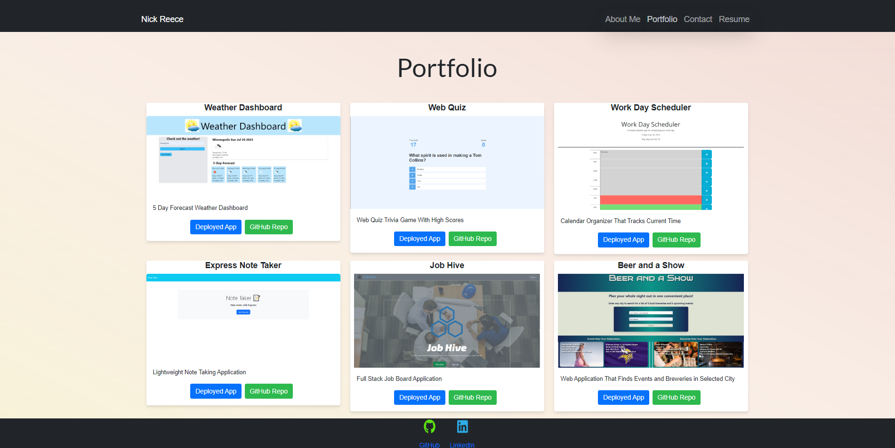

# nick-reece-react-portfolio


## Descritption

This application is a single page React professional portfolio. This portfolio highlights six projects, hosts a Resume, and has a (currently not functioning) contact page.


## Table of Contents

  1. [Usage](#usage)
  2. [Installation](#Installation)
  3. [Contributing](#contributing)
  4. [License](#license)
  5. [Tests](#tests)
  6. [Questions](#questions)


## Usage

Navigate to the deployed portfolio at the link:

https://nreece6.github.io/nick-reece-react-portfolio/

You should be greeted with a landing page. You can view the portfolio pieces themselves and should see a screen similar to this:



Use the navigation bar at the top of the screen to view a section About Me, Portfolio, Contact, and Resume. There is a downloadable Resume available on that screen as well.

## Installation

To install this application, navigate to the repo on my github account https://github.com/nreece6/nick-reece-react-portfolio. Clone the repo and open the folder location of the program in the terminal. You must have node installed in order to run the application. You must also use 

```
npm install
```

In your shell to install all necessary dependencies.

Once you have the repo location open in your terminal, run the program with 

```
npm run develop
```


## Contributing

To contribute, please reach out via email at reece.nick24@gmail.com first.

## License

https://github.com/othneildrew/Best-README-Template/blob/master/LICENSE.txt

MIT License

Copyright (c) 2021 Othneil Drew

Permission is hereby granted, free of charge, to any person obtaining a copy of this software and associated documentation files (the "Software"), to deal in the Software without restriction, including without limitation the rights to use, copy, modify, merge, publish, distribute, sublicense, and/or sell copies of the Software, and to permit persons to whom the Software is furnished to do so, subject to the following conditions:

The above copyright notice and this permission notice shall be included in all copies or substantial portions of the Software.

THE SOFTWARE IS PROVIDED "AS IS", WITHOUT WARRANTY OF ANY KIND, EXPRESS OR IMPLIED, INCLUDING BUT NOT LIMITED TO THE WARRANTIES OF MERCHANTABILITY, FITNESS FOR A PARTICULAR PURPOSE AND NONINFRINGEMENT. IN NO EVENT SHALL THE AUTHORS OR COPYRIGHT HOLDERS BE LIABLE FOR ANY CLAIM, DAMAGES OR OTHER LIABILITY, WHETHER IN AN ACTION OF CONTRACT, TORT OR OTHERWISE, ARISING FROM, OUT OF OR IN CONNECTION WITH THE SOFTWARE OR THE USE OR OTHER DEALINGS IN THE SOFTWARE.

## Test

Not applicable for this application

## Questions

Questions? Reach out via email at reece.nick24@gmail.com. Feel free to view my GitHub account at https://github.com/nreece6.


